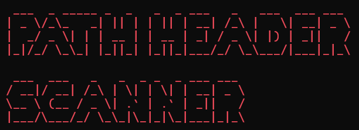

<!-- README.md -->

# 🧭 Path Header Scanner — Safe Repository Path Header Automation

<p align="center">
  
</p>


A clean and lightweight developer utility for automatically inserting, validating, and updating file path headers across source code and documentation files.

Supports:

- Python
- JavaScript / TypeScript
- Shell scripts
- PHP
- HTML
- Markdown

Designed for:

- local development
- Docker workflows
- CI/CD pipelines
- multi-language repositories

---

## ℹ️ Project Metadata

| Property                     | Value                                         |
| ---------------------------- | --------------------------------------------- |
| Project                      | Path Header Scanner                           |
| Current version              | `v1.0.0`                                      |
| Python package               | `path-header-scanner`                         |
| Package compatibility        | Python 3.11+                                  |
| Standard development runtime | Python 3.14                                   |
| CLI framework                | Typer and Rich                                |
| Version strategy             | SemVer tags and PEP 440 package versions      |
| Distribution                 | Source, private GitLab PyPI, Docker, and GHCR |
| Documentation                | Devalltect Docs and repository documentation  |
| License                      | MIT                                           |
| Maintainer                   | Devalltect / Rizky Fernandes                  |

---

## ✨ Features

- Recursive directory scanning
- Automatic path header generation
- Missing header insertion
- Invalid header replacement
- Dry-run support
- Debug logging
- Docker support
- Docker Compose support
- Makefile integration
- Multi-language support
- Markdown support
- Safe header migration
- Shebang preservation
- Encoding declaration preservation
- PHP opening tag preservation

---

## 🔍 Example

Before:

```python
print("hello")
```

After:

```python
# app/main.py

print("hello")
```

Markdown example:

```md
<!-- docs/user-guide/overview.md -->

# User Guide
```

---

## 📦 Installation

Runtime compatibility is Python 3.11+; the standard development and container
runtime is Python 3.14.

### 🔐 Install a private GitLab package

Choose a version already published in the target project's registry. In an
activated virtual environment, replace the placeholders:

```text
python -m pip install --index-url "https://gitlab.com/api/v4/projects/<project-id>/packages/pypi/simple" "path-header-scanner==<package-version>"
path-header-scanner --help
```

Use a deploy token with `read_package_registry`. Supply credentials through
[pip authentication](https://pip.pypa.io/en/stable/topics/authentication/),
not committed files or shared command history. The package version is PEP 440:
`v1.0.0-rc.1` becomes `1.0.0rc1`; `v1.0.0` becomes `1.0.0`.
Use `--index-url`, not `--extra-index-url`; review
[GitLab package forwarding](https://docs.gitlab.com/user/packages/pypi_repository/#package-request-forwarding-security-notice)
if dependencies must stay private.

See [installation and registry guidance](docs/user-guide/installation-methods.md) for authentication,
other installation methods, and registry setup.

### 🧑‍💻 Install from a source checkout

Create and activate a virtual environment in the source checkout, then run:

```bash
python -m pip install -e .
path-header-scanner --help
```

For contributor tooling and pre-commit setup, follow the
[development guide](docs/developer-guide/getting-started.md).

---

## 🚀 Quick Start

### Local

Preview is the default. Select the directory you want to scan; only `--apply`
(or configured apply mode) permits file changes. `--dry-run` overrides both.

```bash
path-header-scanner scan app
```

Apply changes:

```bash
path-header-scanner scan app --apply
```

Debug mode:

```bash
path-header-scanner scan app --debug
```

Explicit dry-run (overrides `--apply`):

```bash
path-header-scanner init --dry-run
path-header-scanner scan app --apply --dry-run
```

---

## 🐋 Docker

From the source checkout, build the production image using the project helper:

```bash
make d-build-prod
```

The default image is `path-header-scanner-prod:latest`. The following mounted
workspace examples use a POSIX shell; see the [Docker workflow guide](docs/developer-guide/docker-workflow.md)
for the Make and Compose alternatives.

Run scanner:

```bash
docker run -it --rm \
    -w /workspace \
    -v "${PWD}:/workspace" \
    path-header-scanner-prod:latest \
    scan app
```

Apply changes:

```bash
docker run -it --rm \
    -w /workspace \
    -v "${PWD}:/workspace" \
    path-header-scanner-prod:latest \
    scan app --apply
```

---

## 🛠️ Makefile Commands

Display the grouped command reference:

```bash
make help
make help-local
make help-docker
make help-compose
make help-remote
```

Preview or apply a scan:

```bash
make l-scan TARGET=src
make l-scan-apply TARGET=src
```

Build and validate through Docker Compose:

```bash
make c-build-all
make c-check
```

See [`docs/developer-guide/make-workflow.md`](docs/developer-guide/make-workflow.md)
for local, Docker, Compose, and published-image workflows.

---

## 📁 Project Structure

```text
app/
├── cli/
├── config/
├── constants/
├── core/
├── languages/
├── models/
├── services/
├── templates/
├── ui/
├── utils/
└── __main__.py
```

See full structure in [`project_structure.md`](docs/project_structure.md).

---

## 🌐 Supported Languages

| Language                | Extensions                   |
| ----------------------- | ---------------------------- |
| Python                  | `.py`                        |
| JavaScript / TypeScript | `.js`, `.jsx`, `.ts`, `.tsx` |
| Shell                   | `.sh`, `.bash`, `.zsh`       |
| PHP                     | `.php`                       |
| HTML                    | `.html`, `.htm`              |
| Markdown                | `.md`, `.markdown`           |

See full documentation in [`supported_languages.md`](docs/project/languages/supported-languages.md).

---

## 📖 Documentation

### User Documentation

- [`user_guide.md`](docs/user-guide/overview.md)
- [`docker.md`](docs/developer-guide/docker-workflow.md)

---

### Developer Documentation

- [`developer_guide.md`](docs/developer-guide/developer-guide.md)
- [`workflow.md`](docs/architecture/workflow.md)
- [`diagrams.md`](docs/architecture/diagrams.md)
- [`design_patterns.md`](docs/architecture/design-patterns.md)
- [`testing.md`](docs/testing/testing-guide.md)

---

### Language Documentation

- [`supported_languages.md`](docs/project/languages/supported-languages.md)
- [`markdown_language_strategy.md`](docs/project/languages/markdown-language-strategy.md)

---

## ⚙️ Repository Metadata Helper (Maintainers)

The optional [metadata sync script](scripts/repository/src/sync_metadata.py)
is source-checkout tooling, not an installed application command. Run it from
this repository's root:

```bash
python scripts/repository/src/sync_metadata.py --dry-run
```

It reads `[project].description` and the separate
`[tool.devalltect.github].topics` / `[tool.devalltect.gitlab].topics` tables
in `pyproject.toml`. Package `keywords` are not repository topics.

Review `GITHUB_REMOTES` and `GITLAB_REMOTES` in the script: the current
defaults are `origin` and `backup`. Each list contains fallback candidates;
the first valid fetch URL selects one repository per provider. Both providers
must resolve. This helper currently targets GitHub.com and GitLab.com.

Dry-run uses Python and read-only Git discovery; it does not call provider
APIs. Live synchronization additionally needs authenticated `gh` and `glab`
with access to update those repositories.

Before removing `--dry-run`, review the targets and metadata carefully:
the live helper does not ask for confirmation, replaces the topic lists, and
clears existing topics when a list is empty or missing. A failure can leave
earlier updates applied; there is no cross-provider rollback.

Known follow-up: the script's docstring still shows the old path, and its
GitHub topic-limit constant is 50 despite
[GitHub's maximum of 20 topics](https://docs.github.com/en/repositories/managing-your-repositorys-settings-and-features/customizing-your-repository/classifying-your-repository-with-topics).
Use the path above and keep the GitHub list within 20 until corrected.
These issues and isolated test coverage are tracked in the
[TODO history](docs/TODO_tracking_history.md).

---

## 📃 Changelog

`CHANGELOG.md` is prepared during the reviewed release process. For current
development milestones, see the [TODO tracking history](docs/TODO_tracking_history.md).

---

## 🔐 Security

See [`SECURITY.md`](SECURITY.md)

---

## 🤝 Contributing

See [`CONTRIBUTING.md`](CONTRIBUTING.md)

---

## 📜 License

This project is licensed under the MIT License.

See [`LICENSE`](LICENSE)

---

## 📝 Notes

- Paths use POSIX-style separators.
- Docker workflows support mounted workspaces.
- Markdown headers use HTML comments intentionally.
- Existing special lines are preserved safely.
- File updates preserve trailing newlines.

📧 Contact: `devalltect00@gmail.com`

---

_Crafted with ❤️ by Devalltect / Rizky Fernandes_
